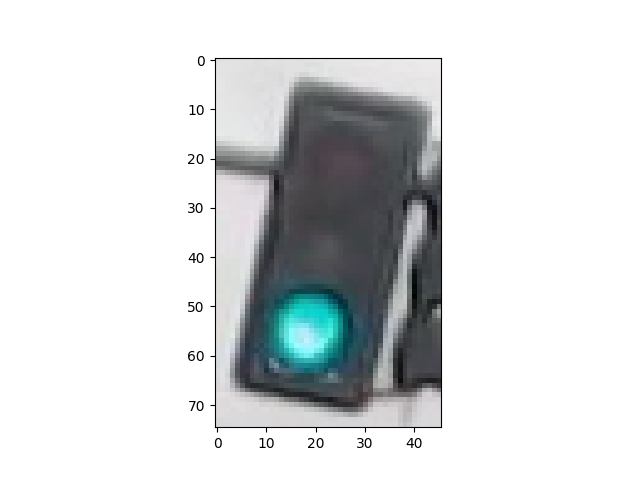

# Traffic-Light-Classifier-Symbolic-AI

This project aims to build a fully functional symbolic AI traffic light classifier, using a variety of computer vision techniques, to be integrated into a self-driving car. It successfully classified 97% of the images, with no red misclassifications as green to maximize safety. A second version of the code achieves 99% accuracy, but with one red misclassification as green of a low-quality image.

This program pre-processes the images, extracts features that will help distinguish the different types of images, and uses these features to classify the traffic light images into classes corresponding to each the light color.

**1. Loading and visualizing the data.** The first step was developing a display function to visualize and familiarize myself with the data.

**2. Pre-processing.** Secondly, the images and output labels needed to be standardized. Thus, all the images can be analyzed using the same classification pipeline, and we know what output to expect for every new image classification.

**3. Feature extraction.** Thirdly, I applied some filters and masks to extract the features from the images that will help to classify them into the three categories.

**4. Classification and visualizing the error.** Finally, I wrote the function that integrates image pre-processing, feature extraction and visualization to classify any traffic light. It takes an image as an input and outputs a label, and determines the model's accuracy.

---------

# 1. Prerequisites.

- OpenCV
- NumPy
- MatPlotLib
- IPython

# 2. Loading and visualizing the data.

This traffic light dataset consists of 1484 number of color images in 3 categories - red, yellow, and green. As with most human-sourced data, the data is not evenly distributed among the types. There are:

* 904 red traffic light images
* 536 green traffic light images
* 44 yellow traffic light images

Note: All images come from this [MIT self-driving car course](https://selfdrivingcars.mit.edu/) and are licensed under a [Creative Commons Attribution-ShareAlike 4.0 International License](https://creativecommons.org/licenses/by-sa/4.0/).

